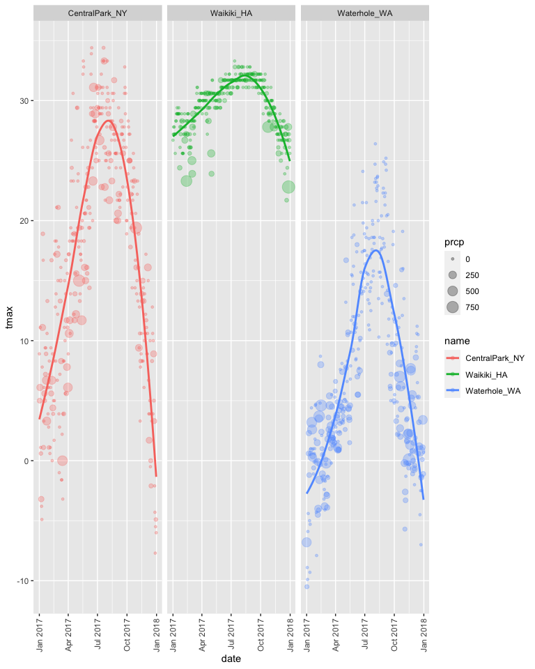

viz_part_1
================
Tianshu Liu
2022-09-29

## Import data

``` r
library(tidyverse)
library(ggridges)

weather_df = 
  rnoaa::meteo_pull_monitors(
    c("USW00094728", "USC00519397", "USS0023B17S"),
    var = c("PRCP", "TMIN", "TMAX"), 
    date_min = "2017-01-01",
    date_max = "2017-12-31") %>%
  mutate(
    name = recode(
      id, 
      USW00094728 = "CentralPark_NY", 
      USC00519397 = "Waikiki_HA",
      USS0023B17S = "Waterhole_WA"),
    tmin = tmin / 10,
    tmax = tmax / 10) %>%
  select(name, id, everything())

weather_df
```

    ## # A tibble: 1,095 × 6
    ##    name           id          date        prcp  tmax  tmin
    ##    <chr>          <chr>       <date>     <dbl> <dbl> <dbl>
    ##  1 CentralPark_NY USW00094728 2017-01-01     0   8.9   4.4
    ##  2 CentralPark_NY USW00094728 2017-01-02    53   5     2.8
    ##  3 CentralPark_NY USW00094728 2017-01-03   147   6.1   3.9
    ##  4 CentralPark_NY USW00094728 2017-01-04     0  11.1   1.1
    ##  5 CentralPark_NY USW00094728 2017-01-05     0   1.1  -2.7
    ##  6 CentralPark_NY USW00094728 2017-01-06    13   0.6  -3.8
    ##  7 CentralPark_NY USW00094728 2017-01-07    81  -3.2  -6.6
    ##  8 CentralPark_NY USW00094728 2017-01-08     0  -3.8  -8.8
    ##  9 CentralPark_NY USW00094728 2017-01-09     0  -4.9  -9.9
    ## 10 CentralPark_NY USW00094728 2017-01-10     0   7.8  -6  
    ## # … with 1,085 more rows

Let’s make a scatter plot.

``` r
weather_scatterplot = 
  weather_df %>%
  drop_na() %>%
  filter(name == "CentralPark_NY") %>%
  ggplot(aes(x = tmin, y = tmax))

weather_scatterplot + geom_point()
```

<!-- -->

``` r
# aes(color) in ggplot => 3 diff lines
weather_df %>%
  ggplot(aes(x = tmin, y = tmax, color = name)) + 
  geom_point() +
  geom_smooth()
```

<!-- -->

``` r
# aes(color) in geom_point => 1 line
weather_df %>%
  ggplot(aes(x = tmin, y = tmax)) + 
  geom_point(aes(color = name)) + 
  geom_smooth()
```

<!-- -->

``` r
# aes(color) in both geom_point and geom_smooth => 3 diff lines
weather_df %>%
  ggplot(aes(x = tmin, y = tmax)) + 
  geom_point(aes(color = name)) + 
  geom_smooth(aes(color = name))
```

<!-- -->

``` r
weather_df %>%
  ggplot(aes(x = tmin, y = tmax, color = name)) + 
  geom_point(alpha = .3) +
  geom_smooth(se=FALSE)   # se: confidence interval
```

<!-- -->

``` r
weather_df %>%
  ggplot(aes(x = tmin, y = tmax, color = name)) + 
  geom_point(alpha = .3) +
  geom_smooth(se=FALSE) + 
  facet_grid(.~name)
```

<!-- -->

``` r
weather_df %>%
  ggplot(aes(x = date, y = tmax, color = name)) + 
  geom_point(aes(size = prcp), alpha = .5) +
  geom_smooth(se = FALSE) + 
  facet_grid(.~name) + 
  theme(axis.text.x = element_text(angle = 90, vjust = 0.5, hjust = 1))
```

<!-- -->

``` r
weather_df %>%
  ggplot(aes(x = tmin, y = tmax)) + 
  geom_hex()
```

<!-- -->

``` r
weather_df %>%
  ggplot(aes(x =tmax, fill = name)) + 
  geom_histogram() +
  facet_grid(. ~ name)
```

<!-- -->

``` r
weather_df %>%
  ggplot(aes(x = tmax, fill = name)) +
  geom_density(alpha = .3)
```

<!-- -->

``` r
weather_df %>%
  ggplot(aes(x = name, y = tmax, fill = name)) +
  geom_boxplot()
```

<!-- -->

``` r
weather_df %>%
  ggplot(aes(x = name, y = tmax, fill = name)) +
  geom_violin()
```

<!-- -->

``` r
weather_df %>%
  ggplot(aes(x = tmax, y = name)) +
  geom_density_ridges(scale = .85)
```

<!-- -->

## Saving and embedding plots

### Save

``` r
weather_scatterplot = 
  weather_df %>%
  ggplot(aes(x = date, y = tmax, color = name)) + 
  geom_point(aes(size = prcp), alpha = 0.3) + 
  geom_smooth(se = FALSE) +
  facet_grid(.~name) + 
  theme(axis.text.x = element_text(angle = 90, vjust = 0.5, hjust = 1))

weather_scatterplot
```

<!-- -->

``` r
ggsave("./results/weather_scatterplot.png", weather_scatterplot, 
       width = 8, height = 5)
```
