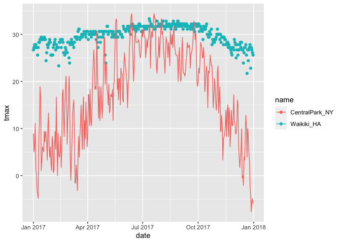
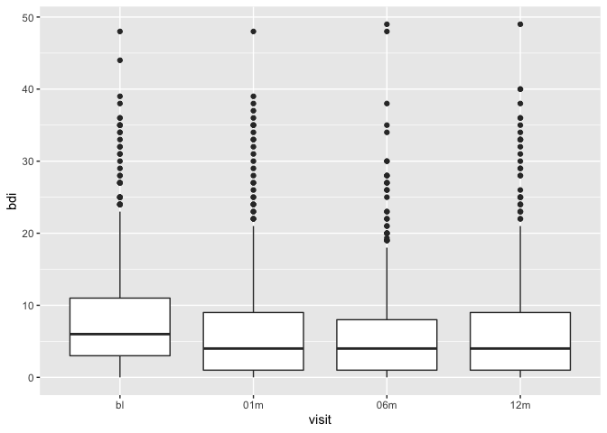

viz_part_2
================
Tianshu Liu
2022-10-04

## Import data

``` r
library(tidyverse)
library(patchwork)
library(ggridges)

weather_df = 
  rnoaa::meteo_pull_monitors(
    c("USW00094728", "USC00519397", "USS0023B17S"),
    var = c("PRCP", "TMIN", "TMAX"), 
    date_min = "2017-01-01",
    date_max = "2017-12-31") %>%
  mutate(
    name = recode(
      id, 
      USW00094728 = "CentralPark_NY", 
      USC00519397 = "Waikiki_HA",
      USS0023B17S = "Waterhole_WA"),
    tmin = tmin / 10,
    tmax = tmax / 10) %>%
  select(name, id, everything())

weather_df
```

    ## # A tibble: 1,095 × 6
    ##    name           id          date        prcp  tmax  tmin
    ##    <chr>          <chr>       <date>     <dbl> <dbl> <dbl>
    ##  1 CentralPark_NY USW00094728 2017-01-01     0   8.9   4.4
    ##  2 CentralPark_NY USW00094728 2017-01-02    53   5     2.8
    ##  3 CentralPark_NY USW00094728 2017-01-03   147   6.1   3.9
    ##  4 CentralPark_NY USW00094728 2017-01-04     0  11.1   1.1
    ##  5 CentralPark_NY USW00094728 2017-01-05     0   1.1  -2.7
    ##  6 CentralPark_NY USW00094728 2017-01-06    13   0.6  -3.8
    ##  7 CentralPark_NY USW00094728 2017-01-07    81  -3.2  -6.6
    ##  8 CentralPark_NY USW00094728 2017-01-08     0  -3.8  -8.8
    ##  9 CentralPark_NY USW00094728 2017-01-09     0  -4.9  -9.9
    ## 10 CentralPark_NY USW00094728 2017-01-10     0   7.8  -6  
    ## # … with 1,085 more rows

## Scatterplot

``` r
weather_df %>% 
  ggplot(aes(x = tmin, y = tmax)) + 
  geom_point(aes(color = name), alpha = .5)
```

<!-- -->

``` r
weather_df %>%
  ggplot(aes(x = tmin, y = tmax, color = name)) +
  geom_point(alpha = .5) + 
  labs(
    x = "Minimum Daily Temp(C)",
    y = "Maximum Daily Temp(C)",
    title = "Scatterplot of daily temp extremes",
    caption = "Data come from the rnoaa package"
  ) + 
  scale_x_continuous(
    breaks = c(-10, 0, 15),
    labels = c("-10C", "0", "15")
  ) + 
  scale_y_continuous(
    trans = "sqrt"
  )
```

<!-- -->

``` r
weather_df %>%
  ggplot(aes(x = tmin, y = tmax, color = name)) +
  geom_point(alpha = .5) + 
  labs(
    x = "Minimum Daily Temp(C)",
    y = "Maximum Daily Temp(C)",
    title = "Scatterplot of daily temp extremes",
    caption = "Data come from the rnoaa package"
  ) +
  scale_color_hue(
    name = "Location",
    h = c(100, 360)    # h is a range of colors
  )
```

<!-- -->

``` r
ggp_weather = weather_df %>%
  ggplot(aes(x = tmin, y = tmax, color = name)) +
  geom_point(alpha = .5) + 
  labs(
    x = "Minimum Daily Temp(C)",
    y = "Maximum Daily Temp(C)",
    title = "Scatterplot of daily temp extremes",
    caption = "Data come from the rnoaa package"
  ) +
  viridis::scale_color_viridis(
    name = "Location", 
    discrete = TRUE
  )

ggp_weather
```

<!-- -->

``` r
ggp_weather + 
  theme_bw()    # black & white
```

<!-- -->

``` r
ggp_weather + 
  theme_classic()
```

<!-- -->

``` r
ggp_weather + 
  theme_minimal() + 
  theme(legend.position = "bottom")
```

<!-- -->

``` r
ggp_weather + 
  theme(legend.position = "bottom") +
  theme_minimal()     # minimal has no effect
```

<!-- -->

## Data in geom()

``` r
central_park_df = 
  weather_df %>%
  filter(name == "CentralPark_NY")

waikiki_df = 
  weather_df %>%
  filter(name == "Waikiki_HA")

ggplot(waikiki_df, aes(x = date, y = tmax, color = name)) +
  geom_point() +
  geom_line(data = central_park_df)
```

<!-- -->

## Patchwork

Show figures together.

``` r
tmax_tmin_plot = 
  weather_df %>%
  ggplot(aes(x = tmin, y = tmax, color = name)) +
  geom_point() + 
  theme(legend.position = "none")

prcp_density_plot = 
  weather_df %>%
  filter(prcp > 0) %>%
  ggplot(aes(x = prcp, fill = name)) + 
  geom_density(alpha = .5) +
  theme(legend.position = "none")

seasonality = 
  weather_df %>%
  ggplot(aes(x = date, y = tmax, color = name)) + 
  geom_point() +
  theme(legend.position = "none")

(tmax_tmin_plot + prcp_density_plot) / seasonality
```

<!-- -->

## Data manipulation

``` r
# original boxplot
weather_df %>%
  ggplot(aes(x = name, y = tmax)) + 
  geom_boxplot()
```

<!-- -->

``` r
# order the boxes
# fct_relevel
weather_df %>%
  mutate(name = fct_relevel(name, c("Waikiki_HA", "Waterhole_WA"))) %>%   # change name to factor variable
  ggplot(aes(x = name, y = tmax)) + 
  geom_boxplot()
```

<!-- -->

``` r
# fct_reorder => order by tmax
weather_df %>%
  mutate(name = fct_reorder(name, tmax)) %>% 
  ggplot(aes(x = name, y = tmax)) + 
  geom_boxplot()
```

<!-- -->

``` r
pulse_df = 
  haven::read_sas("./data/public_pulse_data.sas7bdat") %>%
  janitor::clean_names() %>%
  pivot_longer(
    bdi_score_bl:bdi_score_12m,
    names_to = "visit",
    values_to = "bdi",
    names_prefix = "bdi_score_"
  ) %>%
  select(id, visit, everything()) %>%
  mutate(
    visit = fct_relevel(visit, "bl")  # relevel bl to 1st place
  )

pulse_df %>%
  ggplot(aes(x = visit, y = bdi)) +
  geom_boxplot()
```

<!-- -->
